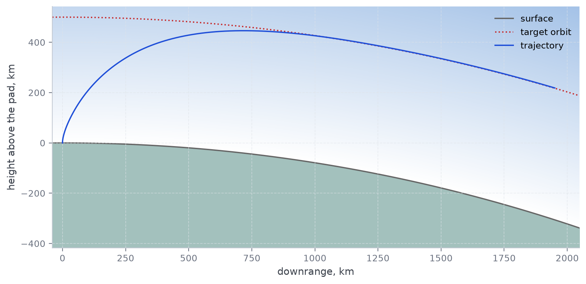

# lv-ascent-model



*Falcon 9 from Cape Canaveral into a 500 km circular orbit on the five-phase
turn: the ascent in the plane of the launch, drawn to scale over the curve of
the Earth. One of the ten plots of `uv run ascent f9 --report`.*

A two-dimensional model of the powered ascent of a launch vehicle, from
lift-off to orbit insertion. The vehicle flies a prescribed pitch programme;
the model integrates the trajectory that results, reports the orbit it reaches,
and accounts for the velocity spent on the way — against gravity, against the
air, and on steering the thrust away from the velocity in order to fly the
programme. That last figure is what different pitch programmes are compared by.

Three programmes are implemented — a five-phase turn, a turn parametrised by
the vertical share of the velocity, and a bilinear tangent — and three vehicles
are configured: Falcon 9, Ariane 62 and H3-22S.

## Installing and running

```sh
uv sync

uv run ascent f9                            # summary of the flight on the console
uv run ascent f9 --csv out/f9.csv           # and the whole trajectory as CSV
uv run ascent f9 --report                   # an HTML report in out/f9, opened
uv run ascent f9 --report out/run-12        # or wherever it is wanted
uv run ascent config/mission.a62.yaml       # a mission file by path

uv run ascent f9 --list                     # solved parameter sets on file
uv run ascent f9 --altitude 650             # fly one of them
uv run ascent f9 --altitude 650 --programme bilinear-tangent
uv run ascent f9 -a 650 -p bt               # the same, in short

uv run ascent-search f9 --altitude 500      # search for a set instead of flying one
uv run ascent-search f9 -a 500 -p 5f --dry-run          # the grid, before it is flown
uv run ascent-search f9 -a 500 -p 5f --range t1=10:30:2 # one parameter, my way
uv run ascent-search f9 -a 650 -p bt --yaml
```

`f9`, `a62` and `h3` are short names for `config/mission.<name>.yaml`, and the
three pitch programmes answer to `5f`, `vs` and `bt` as well as to their full
names. `--altitude` is `-a` and `--programme` is `-p` on both commands.

The console summary lists the set-up, the notable instants of the flight, the
state at engine cut-off, the orbit reached and the velocity budget.

`--report` writes those same figures as a page — laid out as cards, with the
velocity budget drawn to scale — and adds ten plots and the trajectory
tabulated every five seconds. The plots are PNG files beside the page, drawn
well above screen resolution so that they stay sharp when opened full size or
printed; the styles are inlined, so the page can be sent on with the images
next to it. It is opened in a browser as soon as it is written, which
`--no-open` suppresses. Given no directory it writes to `out/` and the name of
the vehicle file, so `ascent f9 --report` lands in `out/f9`. The page carries
the command that produced it, so a report found months later says how to make
it again.

## The model

The flight is planar and written in polar coordinates about the centre of the
Earth: the distance `r` and the angle `psi` travelled from the pad.

**Two velocities.** The state is integrated in the frame that rotates with the
Earth, so the speed the model carries is the speed relative to the atmosphere
and to the launch site. The inertial speed adds the rotation the pad already
had, and it is the one the orbit is built from. Earth rotation is never added
as an initial jump: the vehicle stands still on the pad while the equations
carry the centrifugal and Coriolis terms of the rotating frame, so the two
velocities stay consistent throughout. Launching due north (`azimuth: 0`) makes
them equal.

**Forces.** Thrust interpolated between the sea-level and vacuum figures by
ambient pressure; gravity as a central field on the measured gravitational
parameter, `mu = 3.986004418e14` m³/s², rather than on a product of a
tabulated G and mass of the Earth; less the centrifugal term of the rotating
frame; drag from a Mach-dependent coefficient and the ICAO standard
atmosphere, taken as zero above 100 km. The velocity budget is projected the
same way the equations of motion are: what the propellant delivered, less the
gravity and aerodynamic losses, is the speed reached, to within a metre or two.
The steering loss is not in that sum - it is the price of holding the
programme, recovered afterwards rather than paid by the trajectory.
Thrust and drag act along the axis of the vehicle, which is the zero-lift
assumption of a vehicle flying at a small angle of attack.

**Guidance.** While the pitch programme runs it fixes the direction of the
velocity and only the magnitude is integrated; the thrust deflection that would
be needed to hold that direction is recovered from the normal equation of
motion, and the share of thrust it points away from the velocity is accumulated
as the steering loss. When the programme ends the vehicle holds the attitude it
reached and both velocity components are integrated to the end of the flight.

**Integration.** Fourth-order Runge-Kutta at a fixed step, typically 10 Hz. The
step is cut exactly at every discontinuity inside it — stage separation, engine
cut-off, the end of the programme — and a tank running dry is solved for by
regula falsi rather than estimated. This matters more than the order of the
scheme: at around 60 m/s² an event misplaced by one step at 10 Hz is worth
several m/s, far more than the error of the scheme itself.

## The three pitch programmes

A pitch programme is the law that turns the vehicle from the vertical it lifts
off on to the horizontal an orbit needs — the prescribed flight-path angle
`gamma(t)`, and with it the share of the engine's work that goes into altitude
rather than into speed along the horizon. It is not the attitude control loop:
that is the inner loop which holds the vehicle on the commanded direction
against disturbances, and this model has none of it. What is here is the
command.

All three families below prescribe the same thing and disagree about what to
prescribe it *with*, which is what makes them worth comparing. Each is
tabulated on a tenth-of-a-second grid at construction and read back by
interpolation, so the shape of a programme never enters the equations of motion
— only its value at an instant does. Each ends before the engines do; after its
last instant the vehicle holds the attitude it reached and flies on it to
cut-off.

### Five-phase turn

What is prescribed is the pitch **rate**, as a trapezium, and the angle follows
by integrating it. Five phases: a vertical rise to `t1`; the rate built up from
zero over the share `k2` of the turn; the turn held at that rate over the share
`k3`; the rate arrested over what is left, so that the angle arrives at the
horizon exactly at `t4`; and then the fifth phase, free flight on the attitude
reached, to cut-off.

Prescribing the rate rather than the angle is the point of the family. A turn
written as an angle leaves the rate and the angular acceleration as derived
quantities, and those are exactly what actuator authority and bending loads are
written in terms of; a trapezium in the rate makes the rate continuous at every
joint by construction and the angular acceleration piecewise constant and
bounded, so the control moment stays finite and the programme is something an
attitude loop could actually hold. The requirement that the turn cover the
whole 90 degrees closes the family analytically: the working rate follows from
the angle to be covered, so `t1`, `t4`, `k2` and `k3` are the whole of it.

`k2` and `k3` are shares rather than times, which is what lets a set of
parameters carry across vehicles of different classes and burn lengths. Two
levers set how flat the turn is — the length of the manoeuvre and the share of
it spent at a constant rate — and both rise with the target altitude while the
peak rate falls with it — a higher orbit needs a longer burn, and a longer manoeuvre can be
made flatter, spending the propellant on horizontal speed rather than on
holding the thrust away from the horizon (R. Keba and A. M. Kulabukhov,
*Journal of Rocket-Space Technology* **34**(4), 115–122 (2025),
[doi:10.15421/452553](https://doi.org/10.15421/452553)).

### Velocity share

What is prescribed is `eta = V_vertical / V = sin(gamma)`: the share of the
speed that is pointed up. The family comes out of launch telemetry — across
Falcon 9 flights that share starts at one, falls monotonically, and arrives at
very nearly zero at cut-off, staying inside `[0, 1]` throughout — and out of
what that split buys. Taking the pair "speed magnitude and vertical share"
rather than two independent velocity components separates the energetics of the
flight from the geometry of the turn: the magnitude comes from the vehicle's
own thrust and mass through the Tsiolkovsky equation and so is attainable by
construction, while the share carries the whole of the steering. That is what
makes the altitude reached an integral of the programme, `h = integral of
eta*V dt`, which can be evaluated without integrating the equations of motion —
and it is the estimate the search screens its grid with.

The share is prescribed by phases: one over the vertical rise, a quartic over
the turn from `t1` to `tf`, and zero from `tf` to cut-off, where the velocity
is already in the horizon. The quartic is the lowest-degree polynomial that can
meet the four boundary conditions — one and zero at the ends, flat at both — and
still keep a free parameter, and `s` is that parameter: it sets how full the
turn is, how long the share lingers near one, and so how much altitude the
ascent accumulates. Outside `|s| <= 3` the quartic leaves `[0, 1]` and stops
being a turn, which is why the family refuses it. Being flat at both ends is
what makes the turn join the vertical rise and the horizontal phase without a
kink in the rate, and what makes a turn that runs all the way to cut-off leave
the vehicle on the horizon anyway: the double root holds the share under `1e-7`
at the last tabulated instant.

The method behind this family is not published yet; its DOI belongs here and
is a placeholder until it is —
[doi:XX.YYYYY/ZZZZZ](https://doi.org/XX.YYYYY/ZZZZZ).

### Bilinear tangent

What is prescribed is `tan(gamma) = (a*tau + b) / (c*tau + 1)`, with `tau`
counted from the end of the vertical rise. This is the classical optimal
steering law of powered flight — what the calculus of variations returns for a
flat Earth, constant gravity and no atmosphere — and it is here as an explicit
programme with its coefficients as parameters rather than as something solved
for. It has no phases: one expression covers the turn from `t1` to `te`.

Three things about it are worth knowing before fitting it. Its numerator
cancels to almost nothing at the end of the turn, and that cancellation is what
levels the vehicle out, so the last digits of `a` and `b` carry the terminal
angle — round them and the perigee moves by a kilometre. Its coefficients are
nearly degenerate, in that scaling `b` and `c` together leaves almost the same
turn, which is why the search grids the angles the turn passes through instead.
And it steps the angle at `t1`, from the vertical straight to `arctan(b)`,
so how far that start angle is from 90 degrees is the size of a discontinuity
rather than a free choice; the eighteen sets on file start between 84.7 and
89.2 degrees.

### What they cost

Flown into the same orbit by the same vehicle, the three differ mostly in what
they spend. The steering loss — the share of the thrust that holding the
programme points away from the velocity — is what a programme is judged by, and
gravity is what it trades against: a flatter turn steers less and climbs
longer. `examples/steering_loss_comparison.py` flies all three into a 500 km
orbit and prints the three budgets side by side; the programme with the
smallest steering loss is not the one with the smallest total.

### How hard they work the guidance

The steering loss weighs propellant: how much of the thrust went the wrong way.
It says nothing about how that demand is spread over the burn, and two
programmes that cost the same can reach it very differently. The second measure
is the control-effort functional

    J = integral over the powered flight of a_control^2 dt,   m²/s³

where `a_control` is the normal acceleration the guidance has to produce to
hold the programme — the same quantity the steering loss is recovered from,
one step before it is turned into a deflection:

    a_control = v gamma' + (g - v²/r - omega² r) cos(gamma) - 2 omega v

The square is the point of it: an abrupt stretch is charged more than an even
one, so two programmes with the same loss are still told apart by how smoothly
they ask for it. And it is built on the demand before that demand is clamped to
a deflection of 90 degrees, deliberately — so, unlike the loss, it does not
saturate where the thrust cannot hold the programme. On H3 the demand reaches
2.9 and the steering losses of the three programmes stop being comparable,
while `J` goes on separating them. It is not part of the velocity budget: it is
not a velocity, and a sum with it would mean nothing.

`examples/control_effort_comparison.py` flies the same three Falcon 9 sets and
draws the two accumulations side by side — where the curves part is where the
programme swings the flight-path angle:

```sh
uv run python examples/control_effort_comparison.py    # writes out/control-effort.png
```

```
programme               steering      effort  peak demand
five-phase                 526.4       11169        0.919
velocity-share             411.0        9627        0.841
bilinear-tangent           433.0        9779        1.031
```

On these three the two measures agree on the order, which is worth knowing
rather than assuming, but not on the margins: the five-phase turn costs a fifth
more velocity than the bilinear tangent and a seventh more effort. And the
bilinear tangent is the case the second measure exists for — its demand peaks
at 1.031 just after separation, so its loss sits on the clamp for four seconds
of the burn, where the effort is still reading the demand itself.

## Modules

| Module | What is in it |
|---|---|
| `mission.py` | the equations of motion, the stepping that solves them, the cutting of the step at events, and the steering-loss and control-effort accounting |
| `pitch.py` | the three pitch programmes and the tabulation they share |
| `vehicle.py` | stages, propulsion, mass and drag of the launch vehicle |
| `atmosphere.py` | ICAO standard atmosphere and the gravity field |
| `orbit.py` | the osculating orbit recovered from a position and an inertial velocity |
| `losses.py` | the velocity budget: gravity, aerodynamic and steering losses |
| `estimates.py` | the ascent time and the altitude reached, by quadrature rather than by integration |
| `search.py` | the grid search for the parameters of a pitch programme |
| `integrators.py` | the Runge-Kutta step, knowing nothing about rockets |
| `cutoff.py` | when the engines stop — by time, by altitude or by inertial speed |
| `state.py` | one sample of the flight |
| `telemetry.py` | the recorded flight and its CSV form |
| `summary.py` | the console summary |
| `report.py` | the HTML report: the plots, the cards and the flight log |
| `templates/` | the markup and the stylesheet of that report, rendered with Jinja |
| `config.py` | building a mission from YAML, and reading the catalogue |
| `cli.py` | the `ascent` and `ascent-search` commands |
| `constants.py` | constants of the Earth model |

## Configuration

A mission file names the vehicle file beside it, the pitch programme and its
parameters, when the engines stop, and where the launch site is:

```yaml
vehicle: lv.f9
target_altitude: 500_000       # altitude of the circular orbit aimed for, m
launch_site:
  name: Cape Canaveral SLC-40, Florida   # reported, and nothing more
  latitude: 28.5
  azimuth: 90                  # degrees from north: 90 is due east
pitch_programme:
  type: five-phase             # or velocity-share, or bilinear-tangent
  t1: 20.0
  t4: 502.8
  k2: 0.056178
  k3: 0.522859
cutoff:
  type: time                   # or altitude, or inertial-speed
  time: 502.8
simulation:
  duration: 600
  steps_per_second: 10
```

A vehicle file lists the stages in the order they burn, each taking over at its
own `ignition_time`, along with the drag coefficient against Mach number. The
mass of the vehicle is the sum over the stages still on it, so an entry holds
only what it adds to the stack - which for the two vehicles with strap-on
boosters means the boosted phase carries the boosters and the core propellant
it spends, and the core itself belongs to the entry that flies on after
separation. The last stage carries no propellant: it is the payload. See
`config/lv.f9.yaml` for the simple case and `config/lv.a62.yaml` for the other.

The three programmes take these parameters — what each of them means is above,
under [The three pitch programmes](#the-three-pitch-programmes):

| Programme | Parameters |
|---|---|
| `five-phase`, `5f` | `t1` end of the vertical rise, `t4` end of the programme, `k2` and `k3` the shares of the turn spent building up and holding the pitch rate |
| `velocity-share`, `vs` | `t1` end of the vertical rise, `tf` end of the turn, `te` end of the burn, `s` how full the turn is, between -3 and 3 |
| `bilinear-tangent`, `bt` | `t1` start of the turn, `a`, `b`, `c` of `tan(gamma) = (a*tau + b) / (c*tau + 1)`, `te` end of the programme |

## Catalogue of solved parameter sets

`config/catalogue.yaml` holds parameters that place each vehicle on a circular
orbit of a given altitude - one set per vehicle, pitch programme and altitude,
42 in all. Falcon 9 is covered from 400 to 700 km, Ariane 62 from 400 to
900 km and H3 from 1000 to 1200 km.

Each set is defined by its terminal condition: perigee and apogee both at the
target. The vertical rise `t1` is held at 20 s and the programme ends at
cut-off. The five-phase turn holds `k2` at 0.05 as well: minimising the loss
drives that share of the turn to zero, which is a step in pitch rate and
defeats the point of the phase, so it is a design choice rather than something
the terminal condition can settle - which leaves `k3` and the cut-off time,
two unknowns for two conditions. The other two programmes keep a third
parameter, and among the sets meeting the condition the search that solved
them preferred the smaller steering loss. Every entry records the orbit it
produces and what it costs, and `tests/test_catalogue.py` flies all of them to
check that it still does.

`ascent-search` no longer works that way. It searches every parameter of a
family, `t1` and `k2` included, and ranks by the orbit reached rather than by
what the ascent cost, so it does not reproduce these sets unless it is told to
hold what they hold - which is the last part of the section below.

```sh
uv run python examples/programme_catalogue.py    # the whole table
```

Two things about the file are worth knowing. The numbers are written to full
precision because near a circular orbit the apogee answers to the cut-off time
at some 80 km per second, and the bilinear tangent is more delicate still - its
numerator cancels to almost nothing at the end of the turn, which is what makes
the vehicle level out, so the last digits of `a` and `b` carry the terminal
angle. And the table has gaps, which are properties of the programmes and of
the vehicles rather than unfinished work: Ariane 62 gives out a little above
900 km, having all but emptied its upper stage by cut-off; the velocity-share
quartic gives out a hundred kilometres earlier still, as it does at 600 km on
Falcon 9; and the five-phase turn covers only the middle of each range, having
no freedom left to stretch to the ends once `k2` is fixed. It places no orbit
at all for Ariane 62, whose turn would have to be one continuous manoeuvre
while the vehicle spends its last several hundred seconds on a low-thrust upper
stage.

## Searching for a parameter set

`ascent-search` solves the problem the catalogue holds the answers to. Give it
a vehicle, a circular orbit and one of the three programme families, and it
sweeps a grid over **every parameter of that family** and returns the sets that
reach the orbit, ranked by how close each came.

```sh
uv run ascent-search f9 --altitude 500
uv run ascent-search f9 --altitude 650 --programme bilinear-tangent
uv run ascent-search f9 -a 500 -p 5f --dry-run             # the grid, before it is flown
uv run ascent-search f9 -a 500 -p 5f --range t1=10:30:2    # one parameter, my way
uv run ascent-search f9 -a 500 -p 5f --range k2=0.05       # or held at one value
uv run ascent-search a62 --altitude 700 --yaml             # as a catalogue entry
uv run ascent-search f9 --altitude 500 --report            # fly it and report it
uv run ascent-search f9 --altitude 500 --csv out/sets.csv  # every set found
uv run ascent-search h3 --altitude 1100 --coarse 0.5       # a quicker, rougher sweep
uv run ascent-search f9 --altitude 500 --workers 1         # in this process alone
```

The mission file supplies the vehicle and the launch site and nothing else;
`--altitude` and `--programme` — or `-a` and `-p` — say what to search for.
`--yaml` prints the set found as a catalogue entry, ready to paste; `--report`
turns it into that same entry, flies it and writes the page `ascent --report`
writes, so a set that was searched for and one that was filed give the same
report. A set that misses the orbit is not an entry: it is printed, and it is
not flown. A search prints its progress as it runs — which pass it is on, how
many trajectories it has integrated and roughly how much longer it will take.

**Every parameter of the turn is an axis.** Nothing is held behind your back.
The vertical rise, the shape of the turn, the instant the programme ends and
the instant the engines do are all coordinates of the same grid, and `--dry-run`
prints every one of them with the range and the step it will be searched over:

| family | parameters on the grid, and what each is |
|---|---|
| `five-phase` | `t1` the vertical rise, 12–30 s · `k2` the share of the turn spent building the pitch rate up, 0.03–0.09 · `k3` the share spent at a constant rate, 0–0.9 · `t4` the end of the turn, over the cut-off window · `angle` the flight-path angle the turn is aimed at, 0° · `coast` powered flight after the programme, 0 s |
| `velocity-share` | `t1` · `turn` where the turn ends as a share of the end of the programme, 0.5–1 · `s` the fullness of the quartic, −3 to 3 · `te` the end of the programme, over the cut-off window · `coast` |
| `bilinear-tangent` | `t1` · `start` the angle the turn begins at, 80–89.6° · `mid` how far through the turn the middle angle is prescribed, 0.5 · `middle` that angle, 5–60° · `te` · `angle` the angle the turn ends at, 0° · `coast` |

A parameter is held by giving it a range of one node, which is all that
`angle=0`, `mid=0.5` and `coast=0` are: a circular orbit is entered along the
horizon, and every set on file ends its programme exactly at cut-off. They are
axes like the rest, and `--range coast=0:10:2` or `--range angle=-1:1:0.5`
opens either of them. The summary prints the held ones too, with the value they
were held at, so a figure that did not move is one you can see was not asked to.

Two of these are not the programme's own arguments, and both are
reparametrisations rather than things left out. The velocity share takes the
end of its turn as a **share** of the end of the programme, because the two are
not independent — the family refuses a turn that outlasts the burn — so a share
keeps every node of the grid inside the family wherever the cut-off is searched
to, where a pair of times would spend half the grid on sets that do not exist.
The bilinear tangent is gridded through the **angles its turn passes through**
rather than over `a`, `b` and `c`, which are nearly degenerate: scaling `b` and
`c` together leaves almost the same turn, so a grid over them would spend most
of its nodes on programmes it had already flown. The coefficients are recovered
from the three angles. Neither reparametrisation reaches the entry written out:
that carries `a`, `b` and `c` for the one and `tf` for the other, as any
mission file does.

**How a grid is written.** One `--range` per parameter, repeatable:

```sh
--range t1=10:30:2      # from 10 to 30 in steps of 2 — eleven nodes
--range k2=0.05         # held at 0.05 — one node
```

The equals sign separates the parameter from its numbers and the colons
separate the numbers from each other, in the order a Python slice reads in:
low, high, step. The top of a range is a ceiling rather than necessarily a
node — `t1=10:30:7` stops at 24 — and the summary prints where it actually
stopped. A parameter the family does not have is refused at the command line,
with the parameters it does have, rather than several minutes into a search
that has already started.

**What a set is judged by.** Three errors, and they are the three conditions of
a circular orbit at a given altitude:

- the **altitude** at cut-off, against the target;
- the **speed** there, against the speed of the circular orbit that was asked
  for — not against a circle through wherever the vehicle happened to be, which
  a set that levelled off twenty kilometres low would satisfy exactly while
  missing the orbit entirely. The inertial speed, because that is what the
  orbit is built from;
- the **orbit** itself: how far the apogee and the perigee each ended up from
  the circle asked for. Their sum is the ranking.

The first two are printed as a share of what was asked for — the altitude and
the speed of the orbit — and the third as a share of its radius, because an
apogee and a perigee are radii and a difference of radii over an altitude would
be a different error at every target. So the three columns each say something
about themselves and are not to be compared with one another.

The third is the ranking because it is the only one of the three that is not
blind to the shape of the orbit. A set at the right altitude with the right
speed but a degree off the horizon is on an ellipse, and neither of the first
two says so. The sum of the apsidal errors is zero only when apogee = perigee =
target, which is the altitude and the circularity at once, in one relative
figure with no weighting to argue over — and the eccentricity, which is the
spread of the two, is printed beside it.

A set counts as reaching the orbit when all three are inside their tolerances:
`--tolerance` in kilometres for the first and the third, `--speed-tolerance` in
metres per second for the second. Ranked by the third either way, so a search
that reaches nothing still says what came closest rather than saying nothing at
all — which is what tells you where to narrow the grid to next.

**A search is a table before it is an answer.** Every distinct set that closed
an orbit comes back ranked, and `--top` of them are printed — fifteen by
default — with the parameters that were swept and the errors each is judged by.
The sets that meet all three tolerances are marked `*`; the answer at the foot
of the page is the best of those, or simply the best if none of them does.

```
TOP 15 OF THE 8,174 SETS THAT REACHED AN ORBIT, BEST FIRST
703 of them meet all three tolerances, marked *

   #        t1          k2          k3        t4   cut-off   gamma     h km   h err    v m/s   v err   per km   apo km      ecc orbit err
-----------------------------------------------------------------------------------------------------------------------------------------
  1*   23.0801    0.031133    0.549316  502.6720   502.672   0.000   499.99 0.00003   7616.6 0.00000   499.99   500.01 0.000002  0.000003
  2*   23.0801    0.031211    0.549170  502.6720   502.672   0.000   499.98 0.00004   7616.6 0.00000   499.98   500.00 0.000001  0.000003
```

`--csv` writes the whole of that table to a file, not just the head of it, so a
coarse sweep can be looked at as the map it is — sorted, plotted, narrowed on.
A held parameter gets no column, because it is the same in every row and is
printed once above with the value it was held at.

**The two estimates.** Both come from the dissertation this model was written
for, both are quadrature rather than integration, and both are in
`estimates.py`. The search does not work without them: a grid over every
parameter of a family is large, and these are what keep it affordable.

- the **energy-equivalent ascent time** is the instant at which the propellant
  has bought the orbit — the characteristic velocity accumulated less what the
  orbit costs in energy less everything lost on the way. It is what bounds the
  cut-off: the window around it *is* the default range of the `t4`/`te` axis,
  so the search never spends a node on a cut-off the vehicle could not have.
  The same balance says before anything is flown whether the vehicle has the
  propellant for the orbit at all. Measured against the catalogue the estimate
  sits between 4.8 per cent high and 9.1 per cent low, and the window carries
  that band with something to spare. The method is published: R. Keba and A. M.
  Kulabukhov, *Journal of Rocket-Space Technology* **35**(1), 94–99 (2026),
  [doi:10.15421/452567](https://doi.org/10.15421/452567).
- the **analytic altitude integral** is the altitude a programme reaches, taken
  as the integral of the vertical component of the velocity with the speed from
  the Tsiolkovsky equation stage by stage and the flight-path angle read off
  the programme itself. It screens every node: a set whose integral says it
  cannot reach the target is dropped without a trajectory. It reads between
  1.005 and 1.185 times the altitude the flight reaches — never low, because
  the air, the thrust deficit at sea level and the fall of gravity with
  altitude all push the same way — and the screen is that band applied
  backwards, widened to 0.95–1.40 because it is a gate: a node it rejects is
  never flown, and the measurement behind it is of three vehicles. `--no-screen`
  turns it off and flies everything, which is how you check it is not hiding
  anything. The method behind it is not published yet; its DOI belongs here and
  is a placeholder until it is —
  [doi:XX.YYYYY/ZZZZZ](https://doi.org/XX.YYYYY/ZZZZZ).

Neither is accurate enough to stand in for a flight. Both are accurate enough
to say which flights are worth making, and `tests/test_estimates.py` checks
both bands against every entry in the catalogue, so the constants the search
relies on cannot drift away from the data they were measured on.

**The sweep, and the ten passes that close in on it.** A sweep alone cannot
land on an orbit, and the reason is one number: near a circular orbit the
apogee answers to the cut-off time at some 80 km per second. The cut-off axis
spans the whole window the estimate allows, some fifty seconds, so one step of
a twenty-five-node sweep is worth tens of kilometres of apogee — a map of where
in the family the orbit lies, and nothing nearer. So the best node becomes the
centre of a grid one step wide along every axis that was searched, five nodes
to an axis, and the sweep runs again at half the step; ten times over, which
takes that step from a couple of seconds to a couple of milliseconds. That is
what turns the map into a set that meets the tolerance. `--refinements` is how
many, and `--refinements 0` stops after the sweep, which is the map on its own.

Each of those passes is five nodes an axis rather than the whole grid again, so
ten of them cost less than the sweep does. They are held inside the range each
axis was given: a set that comes out on a bound is reported as such rather than
chased past it, because the family may give out there or a better set may lie
outside the range you named.

**How close that gets.** The surface the passes walk has a narrow valley in
it: every shape of turn has its own cut-off that closes the orbit, so the two
move together and the floor between them is thin. All three families land on
it — Falcon 9 to 500 km comes back 13 m out on the five-phase turn, 11 m on the
velocity share and 326 m on the bilinear tangent, against a tolerance of 500 m.

The bilinear tangent is the hardest of the three to land on, for the reason
given further up: it reaches the horizon linearly, so how far the cut-off falls
past the end of its turn *is* the eccentricity of the orbit, and the floor of
its valley is a few hundredths of a second wide where the other two are a good
deal wider.
Where that matters, the answer is the staged recipe below rather than more
passes. The same orbit searched again on a grid narrowed to what the first
search found, with a step of a fiftieth of a second on `te`, comes back 4 m out
like the other two.

**What it costs.**

Falcon 9 to 500 km, at the settings above and with nothing narrowed, on
thirteen processes of a twenty-core machine:

| family | sweep | nodes walked | screened out | trajectories flown | wall clock | error |
|---|---|---|---|---|---|---|
| `five-phase` | 7,600 | 13,532 | 23 % | 10,476 | 5 min 53 s | 13 m |
| `velocity-share` | 5,400 | 10,990 | 45 % | 5,997 | 3 min 32 s | 11 m |
| `bilinear-tangent` | 6,000 | 11,521 | 31 % | 7,998 | 4 min 26 s | 326 m |

The sweep is the whole grid; the ten passes that close in add five nodes an
axis each, and between three hundred and seven hundred of those turn out to
have been walked already — a pass is centred on a node of the pass before it
and reaches a whole width either side — and are skipped rather than flown
twice.

The nodes of a pass are independent, so they are divided over two thirds of the
cores. It finds exactly the same set however many: the nodes are collected in
the order of the grid, so the answer does not depend on how many processes
answered it. `--workers` says how many, and `--workers 1` searches in this
process alone.

`--coarse`, `--steps` and `--dry-run` are the three ways to spend less.
`--coarse 0.5` lengthens the stride of every axis the family gave, leaving any
axis you wrote out yourself alone; `--steps 1` integrates at one step a second
rather than ten, which barely moves the orbit or the budget — the budget is
read off the last powered row, and by then the vehicle is level and out of the
air, so all three integrands are near zero there and the part left out is
fractions of a metre per second. The entry written out asks for ten steps a
second whatever it was searched at. And `--dry-run` costs nothing at all: it
prints the grid and what the passes come to, which is worth reading before a
grid you have widened yourself.

**The staged way to use it.** A sweep says where in the family the orbit lies;
a second search narrowed on to what it found is how the set itself is reached.

```sh
# the map: one sweep, no passes, every set it found written out
uv run ascent-search f9 -a 500 -p bt --refinements 0 --csv out/map.csv

# and the set: narrowed on to what the map showed, with a fine step on te
uv run ascent-search f9 -a 500 -p bt \
    --range t1=20 --range start=87:89:0.5 \
    --range middle=29:31:0.25 --range te=500.5:501.5:0.02
```

`--dry-run` on the second of those says what it will cost before it costs it.

**What the quicker ascent is paid for.** A flatter ascent goes faster lower
down. The set found is reported with the peak dynamic pressure it asks of the
airframe, beside the figure the vehicle file declares it is designed for, and
with the peak thrust deflection it asks of the guidance. Neither enters the
ranking unless you say so: `--max-q` puts the airframe into the constraint, and
a set that peaks above it is then not an answer however close it came, which is
where a limit on the dynamic pressure belongs in a search of this kind and
where the dissertation puts it. Without the flag the peaks are reported and
nothing more, which is how the rest of the model treats them.

```sh
uv run python examples/parameter_search.py       # all three families, side by side
```

**It does not reproduce the catalogue, and should not.** The catalogue holds
four numbers of every set where the dissertation holds them — the vertical rise
at 20 s, the five-phase `k2` at 0.05, the instant the bilinear tangent's middle
angle is prescribed at half way along the turn, and every turn aimed at the
horizon — and solves for what is left.
This searches all of them, so it has freedom the catalogue never spent and
lands somewhere else in the family. Hold those four where the catalogue holds
them and the two agree: `--range t1=20 --range k2=0.05` on Falcon 9 to 500 km
returns `k3` = 0.5309 against the 0.52958 on file and a cut-off of 502.735 s
against 502.712, which is 436 m of orbit, because with `k3` and the cut-off
left for two terminal conditions there is nothing to prefer. Narrow the grid
about that set as well and both come back to four figures, which is what
`tests/test_search.py` checks. Let them
go and it returns `t1` = 23.08 s, `k2` = 0.0311 and `k3` = 0.5493 cutting off
at 502.672 s instead — a different set, on the same circle to 13 m.

What the two do have to agree on is the orbit, and they do. The velocity budget
beside each is what that particular route to it cost, and the routes differ:
the catalogue's five-phase set spends 516.8 m/s on steering and 3110.1 in
total, and the set found here spends 507.6 and 3099.1. Do not read that as the
search finding the cheaper route — it is not asked to, and on another run of
another family it lands on a dearer one. The ranking asks how close the orbit
came and nothing at all about what the route to it cost. `--csv` writes the
velocity budget of every set found beside its errors, which is where to look
when the cheapest route to the circle is wanted rather than the closest one
to it.

## Reproducing a published result

`examples/steering_loss_comparison.py` flies Falcon 9 into a 500 km circular
orbit from Cape Canaveral three times, once per pitch programme, each with the
parameters that minimise its steering loss subject to reaching that orbit, and
prints the velocity budget next to the published figures:

```sh
uv run python examples/steering_loss_comparison.py
```

```
programme                gravity  aerodynamic  steering     total   perigee   apogee
five-phase                2568.8         29.3     526.4    3124.6     499.4    501.0
  published               2568.8         29.3     526.4    3124.5
velocity-share            2538.0         29.7     411.0    2978.7     500.4    506.9
  published               2538.0         29.7     411.0    2978.7
bilinear-tangent          2500.0         29.6     433.0    2962.7     499.4    500.4
  published               2500.0         29.6     433.0    2962.6

largest deviation from the published figures: 0.04 m/s
```

The programme with the smallest steering loss is not the one with the smallest
total: it pays for the saving in gravity losses.

## Tests

```sh
uv run pytest
```

The atmosphere, the orbit determination and the pitch programmes are checked
against closed forms. The integration is checked against the rocket equation,
which horizontal drag-free flight satisfies exactly, and against itself at half
the step — how far a result moves under refinement is its numerical error, and
a mis-timed event looks exactly like that. `tests/test_reference.py` pins the
published velocity budget above to one decimal place, which ties the whole
chain down at once, and `tests/test_catalogue.py` flies every catalogue entry
against the orbit and the losses recorded for it.

## Citing

If you use this model, please cite it — `CITATION.cff` carries the citation
metadata. The DOI of the archived release goes in there once Zenodo has minted
it, alongside the version and the release date of the tag it was cut from.

## Licence

MIT, see `LICENSE`. The vehicle data in `config/` is taken from published
specifications; the drag coefficient profiles are generic ones for a slender
launch vehicle rather than measured data.
